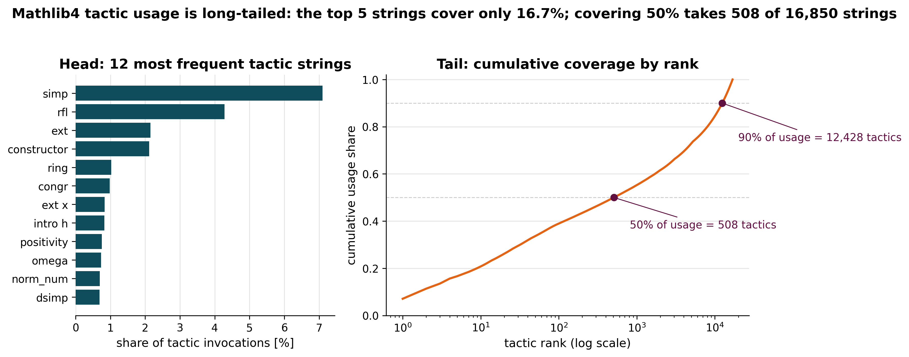
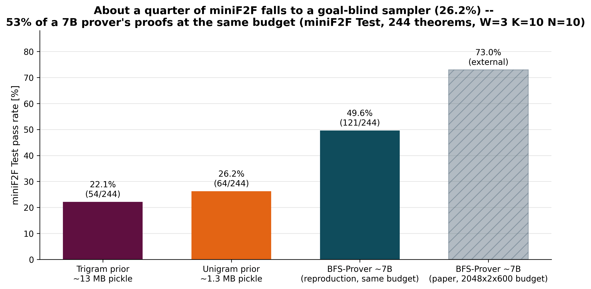
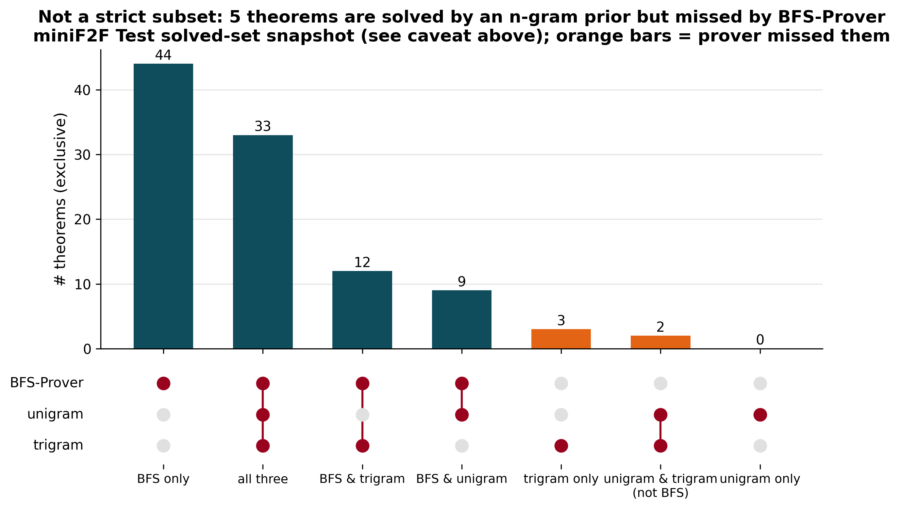
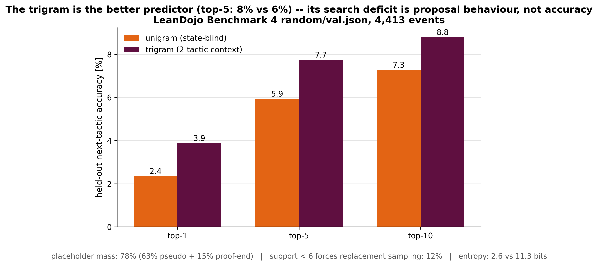

# Generated Formal Theorem Proofs

**Approximately a quarter of miniF2F is trivially provable -- by a sampler
that never looks at the goal.**

The baselines in this repository are *goal-blind*: neither the unigram nor
the trigram ever reads the theorem statement or the proof state. They sample
tactics from the empirical MLE tactic distribution of Mathlib4 (LeanDojo
Benchmark 4) -- the unigram by raw frequency, the trigram conditioned only on
the two *preceding tactics*, still never on the goal. Plugged into a standard
best-first proof search, the unigram proves **26.2%** of miniF2F Test
(64/244) -- about a quarter of the benchmark -- and the goal-blind trigram
proves **22.1%** (54/244).

The second finding: under exactly the same search budget, a 7B-parameter
neural prover (BFS-Prover reproduction) proves **49.6%** (121/244). The
goal-blind frequency table -- 16,850 parameters, roughly 415,000x fewer than
the prover's ~7B -- therefore accounts for roughly half of the neural
system's small-budget performance, a baseline that neural provers are rarely
compared against.

## Approach

1. Count every traced tactic invocation in LeanDojo Benchmark 4
   (`random/train.json`, Mathlib4) to obtain an empirical tactic
   distribution (16,850 distinct tactic strings occurring more than once).
2. Build two goal-blind priors: a **unigram** model (sample tactics by
   frequency, ignore the proof state entirely) and a **trigram** model
   (condition on the two preceding tactics -- never on the goal -- with rare
   tactics collapsed into a pseudo-word below an empirical-probability
   threshold of 1e-5).
3. Evaluate all systems with the same W x K x N best-first search driver
   over LeanDojo: W candidate tactics per expanded state, N frontier
   expansions per pass, K independent passes, frontier re-selected by
   minimum cumulative `-log P` path (length-normalised with ALPHA = 0.5 for
   the neural prover). Details in [docs/methodology.md](docs/methodology.md).

## Results (miniF2F Test, 244 theorems, W=3 K=10 N=10)

| System | Parameters | Pass rate (95% CI) |
|---|---|---|
| Unigram prior (goal-blind) | 16,850 | **26.2%** [21.1%, 32.1%] (64/244) |
| Trigram prior (goal-blind) | 41,204 | **22.1%** [17.4%, 27.7%] (54/244) |
| BFS-Prover (reproduction, same budget) | ~7B | **49.6%** [43.4%, 55.8%] (121/244) |
| BFS-Prover paper (arXiv:2502.03438), budget 2048x2x600 | ~7B | 72.95% (external reference) |

Bracketed intervals are Wilson 95% binomial confidence intervals over the
n=244 theorems of miniF2F Test.

## Key findings

- **About a quarter of miniF2F falls to goal-blind sampling.** A goal-blind
  frequency table of 16,850 parameters that never inspects the goal proves
  64/244 theorems (26.2%); the trigram, equally goal-blind, proves 54/244
  (22.1%). That slice of the benchmark is solved by "guess popular Mathlib4
  tactics" -- no reading of the statement required.
- **The 7B prover roughly doubles the goal-blind baseline at this budget.**
  BFS-Prover proves 121/244 (49.6%) under the same W=3 K=10 N=10 search,
  vs 64/244 for the unigram -- a pass-rate ratio of 0.53. Roughly half of
  small-budget neural proving performance on miniF2F is explained by tactic
  popularity alone.
- **More context does not buy more proofs: unigram vs trigram is within
  statistical noise at this budget.** The trigram's observed pass rate is
  lower (22.1% vs 26.2%), but over 244 theorems the difference is not
  statistically distinguishable (unpaired two-proportion z ~ 1.06; the
  Wilson 95% CIs overlap substantially), so we do not claim the trigram is
  *worse* -- only that conditioning on the two preceding tactics buys no
  measurable search improvement. The prover-vs-unigram gap, by contrast, is
  robust (z ~ 5.32). The notebook's held-out analysis supplies the
  mechanism for why the extra context should *not* be expected to help
  search even though it improves next-tactic prediction: placeholder
  probability mass, tiny conditional supports, and far lower proposal
  entropy -- see `notebooks/analysis.ipynb` for the measured
  proposal-diversity numbers.
- **The baselines are not a strict subset of the prover (snapshot
  evidence).** `artifacts/solved_indexes.json` is an *intermediate
  snapshot* exported from the cluster comparison script -- it reflects
  98/44/50 solved theorems (BFS-Prover/unigram/trigram) out of 244, i.e. it
  predates the final passes that produced the aggregated counts 121/64/54.
  Within that snapshot, several theorems are solved by the n-gram baselines
  but missed by BFS-Prover; exact overlap counts are computed in the
  notebook and labelled as snapshot-level. The final per-pass evaluation
  logs live on the university cluster and are not distributed with this
  repository. For the same reason, a paired per-theorem comparison
  (McNemar's test) of unigram vs trigram is not yet possible from the
  committed artifacts; this repository commits to reporting it once those
  per-pass logs land.

## Figures









## Repository map -- three reproducibility tiers

| Tier | What | Where |
|---|---|---|
| 1. Runnable offline (CPU, no Lean) | Models, artifacts, notebook, tests | `src/tactic_priors/ngram_models.py`, `src/tactic_priors/build_distribution.py`, `artifacts/`, `notebooks/`, `tests/` |
| 2. Reference cluster code (needs lean_dojo + GPU) | Unified W x K x N search driver | `src/tactic_priors/search.py` (guarded imports), design sketch in `sketches/llm_gating.py` |
| 3. Lean solutions (human-written) | miniF2F proofs replacing upstream `sorry` | `minif2f_solutions/` (79 Valid + 2 Test; see its README for licensing) |

```
generated-formal-theorem-proofs/
├── src/tactic_priors/      # ngram_models, build_distribution, search
├── artifacts/              # tactic CSV, trained pickles, solved-index snapshot
├── notebooks/analysis.ipynb# executed analysis (figures reproducible offline)
├── figures/                # publication figures (PNG 300dpi + SVG)
├── minif2f_solutions/      # Lean 4 proofs (statements: Apache-2.0 upstream)
├── sketches/               # design sketch, not used for results
├── docs/methodology.md     # search procedure, smoothing, limitations
└── tests/                  # pytest (CPU-only)
```

The Python package is named `tactic_priors` (`import tactic_priors`); the
module and artifact names predate the project name and are kept stable so
the committed pickles, notebook, and tests keep working unchanged.

## Reproduce tier 1

```bash
git clone https://github.com/amitaminov/generated-formal-theorem-proofs.git && cd generated-formal-theorem-proofs
python -m venv .venv && . .venv/bin/activate   # or .venv\Scripts\activate
pip install -e ".[dev]"
pytest -q                                       # all CPU-only tests

# Rebuild the distribution + trigram model from scratch:
# download LeanDojo Benchmark 4 (generated from Mathlib4 commit f5c3f06,
# traced with LeanDojo 2.2.0) and point the builder at it:
python -m tactic_priors.build_distribution --benchmark-dir /path/to/leandojo_benchmark_4

# Re-execute the analysis notebook (uses committed artifacts; the held-out
# section additionally wants LEANDOJO_BENCHMARK_4_DIR for random/val.json):
jupyter nbconvert --to notebook --execute --inplace notebooks/analysis.ipynb
```

Note that the model files under `artifacts/*.pkl` are Python pickle files, so only load them from a source you trust; `artifacts/empirical_tactics_probability_mathlib4.csv` is the inspectable plain-text equivalent of the underlying tactic distribution.

Tier 2 (proof-search evaluation) additionally requires `lean_dojo==2.2.0`,
a Lean 4 toolchain, a traced miniF2F repository, and for BFS-Prover a GPU;
it was run on a university SLURM cluster.

## Context

This is thesis-adjacent research from my M.Sc. in Computer Science at the
Hebrew University of Jerusalem, studying what statistical structure neural
tactic generators actually add over corpus priors in automated theorem
proving. Ongoing work on the cluster: RL fine-tuning of tactic generators
(GRPO with verifier rewards).

## Contact

Amit Aminov -- amit.aminov@mail.huji.ac.il

## License

MIT for original code and proofs; miniF2F theorem statements under
`minif2f_solutions/` are Apache-2.0 (OpenAI, Lean 4 port by Kaiyu Yang).
See [LICENSE](LICENSE) and [minif2f_solutions/README.md](minif2f_solutions/README.md).
